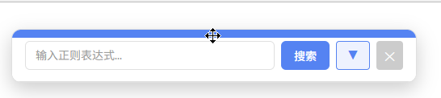

# 正则表达式搜索插件

<p align="center">
简体中文 | <a href="README.en.md">English</a>
</p>

一个强大的 Chrome 扩展程序，为网页带来正则表达式搜索功能，让你可以直接在浏览器中进行高级模式匹配和文本搜索。

[](LICENSE)

## 功能特性

窗口可任意拖动，默认简单界面，不遮挡搜索结果，不影响网页浏览。



按需可打开完整设置界面


### 核心功能
- **正则搜索**：使用完整的正则表达式语法搜索任何网页
- **实时匹配**：输入时即时高亮显示匹配结果
- **导航功能**：使用上一个/下一个按钮轻松在匹配项之间跳转，滚动条上的标记帮助你快速定位
- **匹配计数**：显示找到的匹配项总数

### 高级功能
- **搜索历史**：自动保存最近的搜索记录
- **自定义模式**：创建并保存自己常用的正则表达式模式
- **预设模式**：快速访问常用正则表达式模式：
  - 邮箱地址
  - 网址链接
  - 固定电话
  - 手机号码
  - 日期
  - 时间
  - 身份证号
  - IP地址

### 自定义选项
- **透明度控制**：调整弹窗窗口的透明度（20%-100%）
- **最大匹配数**：限制显示的匹配项数量（1-10000）
- **历史记录限制**：控制保存的搜索模式数量
- **匹配标志**：配置正则表达式标志（g、i、m、s、u）

### 用户体验
- **可拖动窗口**：搜索弹窗可以在页面上自由移动
- **滚动条标记**：滚动条上的可视化标记显示匹配位置
- **复制结果**：将所有匹配结果复制到剪贴板
- **键盘快捷键**：便捷的键盘快捷键实现快速导航

## 安装

### 手动安装
1. 下载或克隆此仓库
2. 打开 Chrome 并导航到 `chrome://extensions/`
3. 启用"开发者模式"（右上角切换开关）
4. 点击"加载已解压的扩展程序"
5. 选择扩展程序目录

## 使用方法

### 打开扩展程序
- 点击 Chrome 工具栏中的扩展图标
- 或使用键盘快捷键：`Ctrl+Shift+F`（Windows/Linux）或 `Cmd+Shift+F`（Mac）

### 基本搜索
1. 在搜索框中输入正则表达式
2. 页面上的匹配项会实时高亮显示
3. 使用导航按钮（< ▶）在匹配项之间跳转

### 模式标志
使用标志配置匹配行为：
- **g**（global）：查找所有匹配项（默认启用）
- **i**（ignore case）：不区分大小写匹配（默认启用）
- **m**（multiline）：多行模式（默认启用）
- **s**（dotall）：点号匹配换行符
- **u**（unicode）：完整的 Unicode 支持

### 快速访问模式
点击"常用正则表达式"部分中的任何预设模式即可搜索：
- 邮箱地址
- 网址
- 电话号码
- 等等...

### 自定义模式
1. 展开"添加自定义正则表达式"
2. 输入名称和正则表达式
3. 点击"➕ 添加"或按回车键
4. 你的自定义模式将出现在常用模式列表中

### 键盘快捷键
| 按键 | 操作 |
|-----|------|
| `Enter` | 搜索 / 下一个匹配项 |
| `Shift + Enter` | 上一个匹配项 |
| `Ctrl + Shift + F` | 打开搜索窗口 |

> 可前往chrome://extensions/shortcuts进行自定义，设置为Ctrl+F 可替换默认搜索。

## 配置

### 设置
展开弹窗并调整以下设置：
- **最大匹配数**：限制搜索结果数量（默认：1000）
- **窗口透明度**：调整弹窗透明度（默认：100%）
- **历史记录限制**：控制保存的搜索历史（默认：20）

### 搜索历史
在"📋 历史记录"部分查看和管理搜索历史：
- 点击任何历史记录项以重复使用
- 点击 ✕ 按钮删除特定项
- 点击"清空"删除所有历史记录

## 开发

### 项目结构
```
regexp_search/
├── manifest.json          # 扩展程序清单
├── icons/                 # 扩展程序图标
├── src/
│   ├── background/        # 后台脚本
│   ├── content/           # 内容脚本
│   └── popup/             # 弹窗 UI（HTML、CSS、JS）
└── styles/                # 内容脚本样式
```

### 构建
无需构建过程。这是一个使用 Manifest V3 的纯 JavaScript 扩展程序。

### 本地测试
1. 在 Chrome 中加载扩展程序（参见安装部分）
2. 修改源文件
3. 进入 `chrome://extensions/`
4. 点击扩展程序卡片上的刷新图标重新加载

## 隐私

本扩展程序：
- 不收集任何个人数据
- 不向外部服务器发送数据
- 所有数据都存储在本地浏览器中
- 搜索时仅访问活动标签页的内容

## 许可证

本项目采用 `Apache-2.0 license` 许可证 - 详情请参阅 [LICENSE](LICENSE) 文件。

## 贡献

欢迎贡献！请随时提交 Pull Request。

## 支持

如有问题、疑问或建议，请在 GitHub 上提交 issue。

## 更新日志

### v1.1.0
- 初始版本
- 基本正则搜索功能
- 预设和自定义模式支持
- 可调节的透明度设置
- 搜索历史管理
- 窗口拖动和键盘快捷键支持

## 温馨提示
- 由于使用默认插件弹出窗口，当点击窗口外部会导致窗口自动消失，体验不好，因此窗口会内嵌到网页中，可能在部分网页上兼容效果不佳甚至影响原网页，如果出现问题，可以禁用此插件刷新网页。